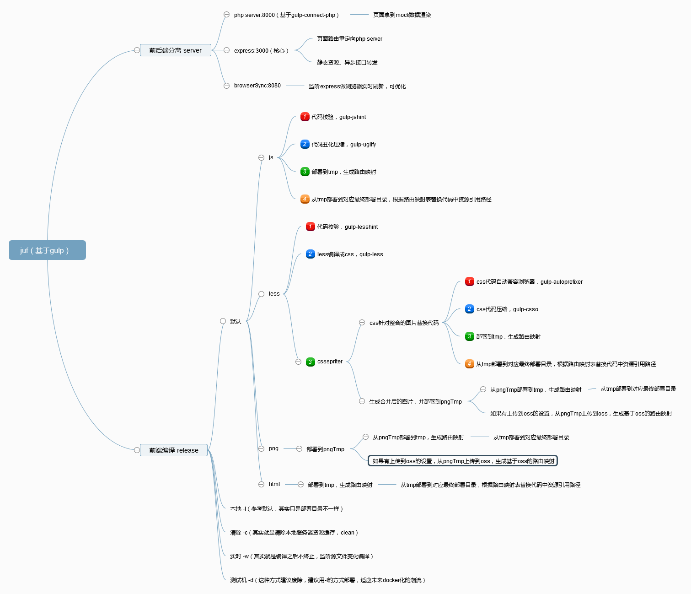

# juf
基于gulp实现的前端脚手架，可作为php的mock server，暂时支持smarty模版和laravel的blade模版

## 安装
npm install juf -g

## 启动服务器
juf server start

### 参数
 - -p 端口，默认8080              `juf server start -p 8081`
 - --type，默认node               `可切换juf server start --type smarty 或juf server start --type blade`

## 发布项目
 juf release(线上部署直接可以juf release -l dest)
 
### 参数
 - -c 清除本地server下部署目录    `juf release -c`
 - -w 热更新                      `juf release -w`
 - -d 指定部署到哪台测试机        `juf release -d gzh`
 - -l 指定本地部署到哪个目录下    `juf release -l '/d/juf/output'`

## demo地址
 - [smarty](https://github.com/allengzh/juf-smarty-demo)
 - [blade](https://github.com/allengzh/juf-blade-demo)

## 关于juf本身的一些核心东西
 
 
 
 

## 备注
 - 由于一期未考虑清楚文件依赖关系之间如何处理，想了一个笨办法就是1、先把文件都部署到一个临时文件夹，然后生成正确的资源路由映射表（local map文件夹下）；2、然后再从临时文件夹部署到最终部署目录并把代码中资源路径根据资源路由映射表替换
 - 本地服务器默认目录在`C:\Users\Administrator\AppData\Local`